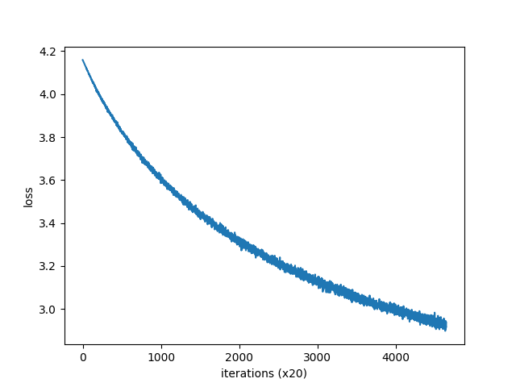
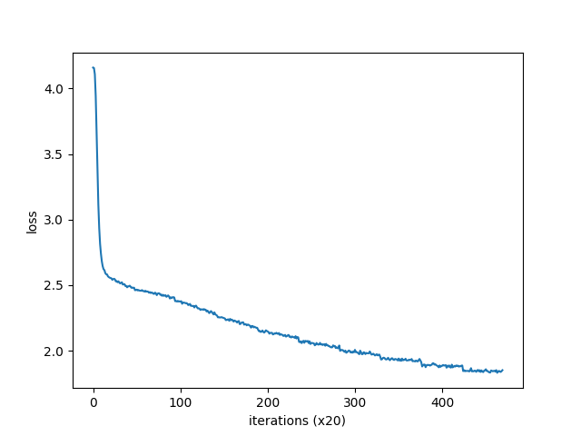

# 深度学习进阶-自然语言处理练习（部分）


## 描述
个人在阅读书籍的时候的自行学习。项目下的common和dataset文件夹、CBOW中的评价代码eval.py来源于原书的github项目 [deep-learning-from-scratch-2](https://github.com/oreilly-japan/deep-learning-from-scratch-2/tree/master)，其余代码大多数都为本人学习书本内容后自行编写。

本代码运算在GPU上（使用cupy）实现。

因为是完全看着书写的，所以写法肯定和书上别无二致。但每一行都是自己亲手打出来的，也添加了一些自己理解基础上的注释。

因为版本兼容等问题，所以会爆出一些奇奇怪怪的错误，对原代码也有部分修改。


## 环境

Python: 3.11.4
cuda: Build cuda_12.2.r12.2/compiler.32965470_0
cupy: 13.3.0

---

## 模型1 word2vec-CBOW

### 模型性能

使用参数如下：

| 参数名称     | 值    |
|--------------|-------|
| batch_size   | 100   |
| hidden_size  | 200   |
| max_epoch    | 10    |
| window_size  | 5     |

得到结果：



感觉这个结果很烂，但不知道为什么出现这个结果。
微调参数没有用，发现原来是代码写错了。

#### 修改后：

使用参数如下：

| 参数名称     | 值    |
|--------------|-------|
| batch_size   | 100   |
| hidden_size  | 200   |
| max_epoch    | 10    |
| window_size  | 5     |

得到结果：



eval.py运行结果如下：

#### 相似单词-结果

| Query  | Result 1          | Result 2          | Result 3          | Result 4          | Result 5          |
|--------|-------------------|-------------------|-------------------|-------------------|-------------------|
| you    | i: 0.9096         | we: 0.9025        | why: 0.8573       | else: 0.8484      | really: 0.8409    |
| year   | month: 0.9406     | week: 0.8700      | spring: 0.8611    | summer: 0.8601    | decade: 0.6798    |
| car    | truck: 0.8415     | vehicle: 0.7987   | portable: 0.7718  | machine: 0.7633   | engine: 0.7625    |
| toyota | honda: 0.8479     | nec: 0.8357       | weyerhaeuser: 0.8334 | shell: 0.8214   | kobe: 0.8172      |

#### 类推-结果

| Analogy                  | Result 1                | Result 2                | Result 3                | Result 4                | Result 5                |
|--------------------------|-------------------------|-------------------------|-------------------------|-------------------------|-------------------------|
| king:man = queen:?       | woman: 6.2753           | veto: 5.7468            | wife: 5.6655            | thing: 5.4849           | lot: 5.4140             |
| take:took = go:?         | a.m: 4.2262             | were: 4.1614            | industrials: 4.1469     | was: 4.0074             | composite: 3.9935       |
| car:cars = child:?       | a.m: 6.0953             | yield: 5.1681           | daffynition: 5.0553     | years: 4.7989           | her: 4.6386             |
| good:better = bad:?      | more: 6.0943            | less: 5.2696            | rather: 4.8580          | far: 4.1169             | higher: 3.8918          |


---

### 1. 对部分原代码的修改
(1)**<font color="red">由于高版本的cupy已经不支持cupy.scatter_add</font>**（该功能自 CuPy v4 起已被弃用），需要从cupyx中调用，因此:

a. 在 common/np.py（原书用于控制是否开启GPU加速）中添加：
```python
import cupyx as cpx
```

 b. 修改common/layers.py下的Embedding层实现中的**np.scatter_add(dW, self.idx, dout)** 为 **cpx.scatter_add(dW, self.idx, dout)**

(2) eval.py使用了common/util.py中的函数analogy，但是很奇怪的是，里面用来访问字典的索引i的类型是 **<class 'cupy.ndarray'>**，会报错：不是可哈希类型。因此在第285行添加
```python
i=int(i)
```

(3) 使用common/util.py下的to_gpu函数报错：
```
AttributeError: module 'numpy' has no attribute 'asnumpy'
```
转换的时候使用了函数np.asnumpy(x)。
查阅资料发现好像当前版本cupy数组不能这样转换，故第174行改为：

```python
    return x.get()
```

---

### 2. 新增加的功能

在CBOW中添加了可视化窗口输入超参数的功能（在hyper_parameter.py中实现），并且会在运行后把超参数保存在config.yaml下。
